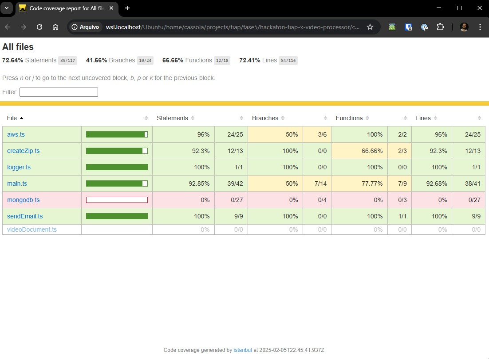

# Video Processor
Projeto do curso de pós graduação da FIAP

## Secrets
Secrets cadastradas no repositório do GitHub

```bash
AWS_REGION
AWS_ACCESS_KEY_ID
AWS_SECRET_ACCESS_KEY
AWS_SESSION_TOKEN
DOCKERHUB_TOKEN
MONGODB_CONNECTION_STRING
MONGODB_DB_NAME
```

## Como rodar o projeto local?
### Docker compose
- Para iniciar
```bash
docker compose up
```
- Para encerrar
```bash
docker compose down
```

## Evidência de cobertura de testes


